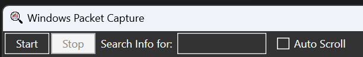
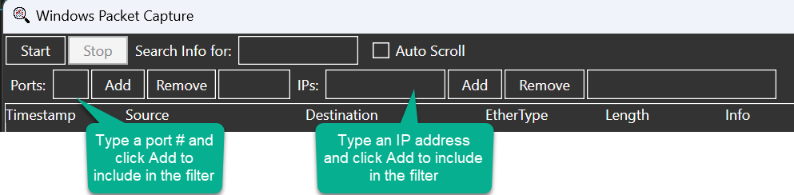
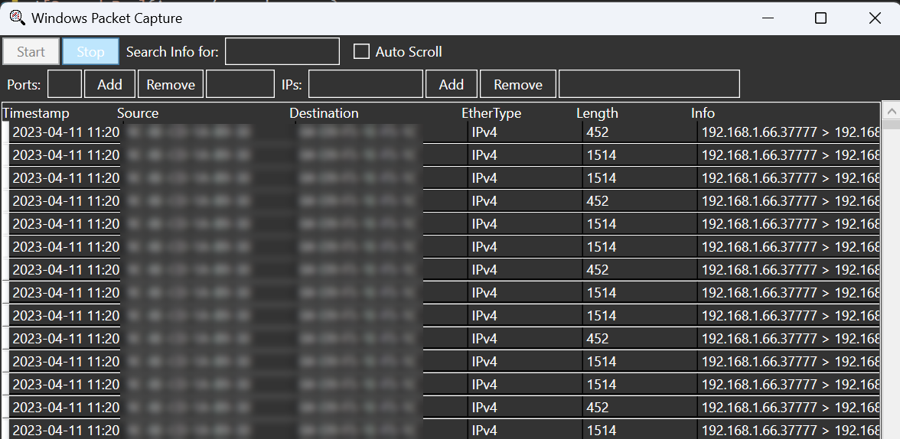

# PacketCapture - Windows Packet Capture GUI
PacketCapture provides a GUI for viewing real-time packet captures in Windows using the built-in pktmon.exe tool.

# Usage
First, download the single executable from <a href="https://github.com/kbcitrite/pktmon/blob/main/bin/PacketCapture.exe" target="_blank">/bin/PacketCapture.exe</a> or build this solution and install <a href="https://dotnet.microsoft.com/en-us/download/dotnet/6.0" target="_blank">the .NET 6.0 desktop runtime</a> if you don't already have it.

Because pktmon.exe requires elevated rights PacketCapture.exe will require administrative rights to run. 

Once opened, there are two buttons on the first row to start or stop a trace, a text box that performs regex searches in the info field, and a checkbox to enable or disable auto-scroll:  

The second row includes two sets of text and list boxes where you can add ports or IP addresses to filter on:  

Clicking Start will stop any running pktmon trace and begin a new one, adding any filters in the listboxes (or none if empty) and display the output in the datagrid:  

Check the 'Auto Scroll' box to automatically scroll to new events as they're logged.
